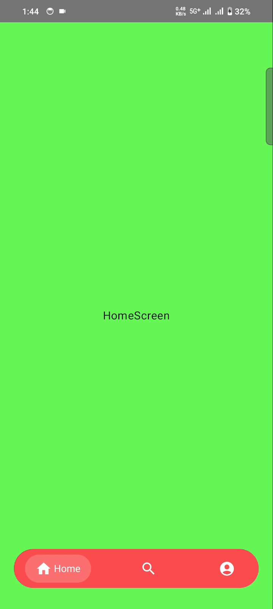

# Animated bottom bar

AnimatedBottomBar is bottom navigation bar with customizable animated tabs




## How to use
```kotlin  
BubbleNavigationBar{
    navigationItems.forEach { navigationItem ->
        BubbleNavigationBarItem(
            selected = currentRoute == navigationItem.route,
            onClick = {
                //Navigate
            },
            icon = navigationItem.icon,
            title = navigationItem.title,
            selectedColor = navigationItem.selectedColor
        )
    }
}
```
